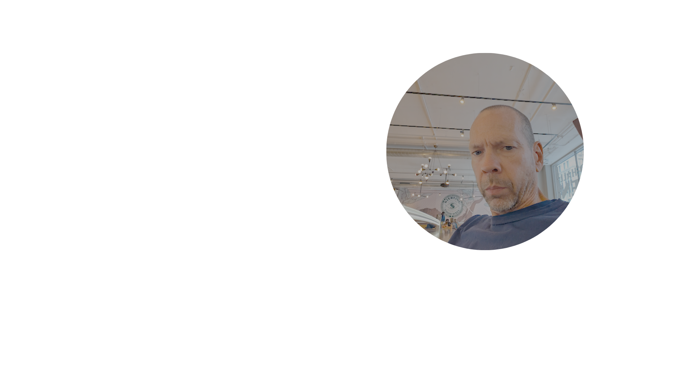

<h1 align="center">Robert Campbell</h1>
<h3 align="center">☁️ Cloud Platform Engineer</h3>

  <!-- AWS Certification badge prominently displayed -->
  

  <!-- Other skill badges -->
  
  
  
  
  
  
  

---

## 🚀 About Me

I’m a platform engineer with substantial experience designing, building, and operating modern cloud-native platforms in both **AWS** and **GCP**.  
I excel at bridging infrastructure and application development teams, automating everything from CI/CD pipelines to infrastructure provisioning.

📜 **Certification:** AWS Certified Solutions Architect – Associate (2024)  

---

## 🛠 Skills & Technologies

### ☁️ Cloud & Platforms
- **AWS**: EKS, API Gateway, Route 53, Lambda, IAM, VPC, S3
- **GCP**: GKE, IAM, Networking, Storage

### 🐳 Containers & Orchestration
- **Kubernetes**: EKS, GKE, Helm, ArgoCD, GitOps
- Containerization: Docker, OCI images

### 💻 Programming & Automation
- **Languages**: Go, Python, Shell scripting (Bash/Zsh)
- **Infrastructure-as-Code**: Terraform / OpenTofu, Helm, Kustomize
- **Automation**: GitLab CI/CD pipelines & reusable components, GitHub Actions

### 📈 Observability & Ops
- OpenTelemetry, Dynatrace, Prometheus/Grafana
- Logging, monitoring, and distributed tracing

---

## 🏗 Working Experience Highlights

- **Platform Engineering in AWS & GCP**  
  Designed and implemented highly available, secure, and scalable platforms for enterprise workloads, spanning both AWS and GCP environments.

- **Kubernetes Specialist**  
  Managed multi-region **EKS** and **GKE** clusters with automated CI/CD delivery via GitLab pipelines and GitOps tools like ArgoCD.

- **Infrastructure Automation**  
  Developed reusable **GitLab CI/CD components** to standardize infrastructure provisioning, application deployment, and secrets management.

- **Cloud Networking & Services**  
  Implemented secure, production-grade setups with AWS **API Gateway**, **Route 53**, **Lambda**, and cross-cloud DNS/networking patterns.

- **IaC Leadership**  
  Led migrations to **OpenTofu/Terraform** for consistent, version-controlled infrastructure deployment across environments.

---

## 📊 GitHub Stats

---

## 📫 Get in Touch

- 💼 [LinkedIn](https://linkedin.com/in/yourname)  
- 📧 [Email Me](mailto:you@example.com)  
- 🌐 [Portfolio / Blog](https://yourwebsite.com)

---

  

